<p align="center">
  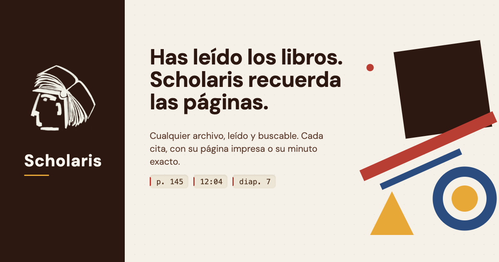
</p>

<p align="center">
  <strong>Una mano que señala la página y luego se aparta.</strong><br>
  Tu biblioteca, leída y citable: en tu ordenador, en tu servidor o en la nube.
</p>

<p align="center">
  <a href="https://github.com/joseluissaorin/scholaris-v2/actions/workflows/ci.yml"></a>
  <a href="LICENSE"></a>
  <a href="https://pypi.org/project/scholaris-sdk/"></a>
  <a href="README.en.md">English</a>
</p>

En los márgenes de los libros antiguos aparece una y otra vez una manita con el índice extendido. Los paleógrafos la llaman manícula, y servía para decirle a un lector futuro «mira aquí», sin decirle qué tenía que pensar de lo que iba a ver.

Scholaris quiere ser esa mano. Lee tus libros, tus artículos, tus apuntes y tus entrevistas, y cuando le preguntas algo no te devuelve una opinión: te señala el pasaje, el libro y la página impresa (la de verdad, la que pondrías en una nota al pie) o el minuto exacto de la grabación en que alguien lo dijo. Si no lo encuentra, lo dice. **No inventa citas**: cada una se comprueba contra el texto que tú le diste antes de enseñártela, y cada dato lleva su procedencia a la vista. Pensar, juzgar y escribir siguen siendo cosa tuya.

<p align="center">
  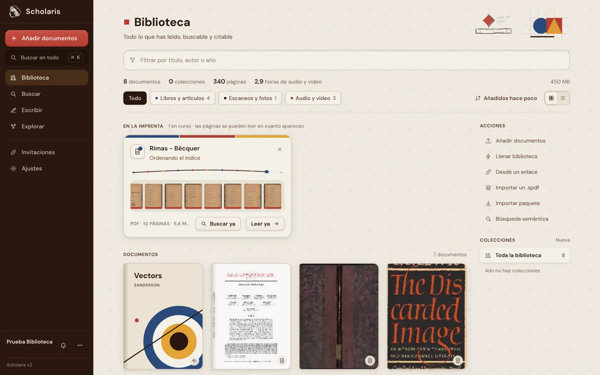
  <br><sub>La biblioteca, con un libro en la imprenta: sus páginas se pueden leer y buscar en cuanto aparecen.</sub>
</p>

<p align="center">
  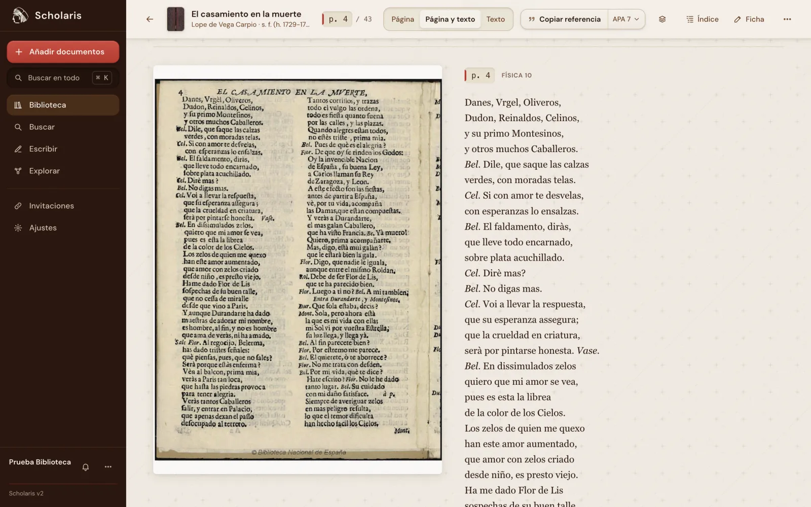
  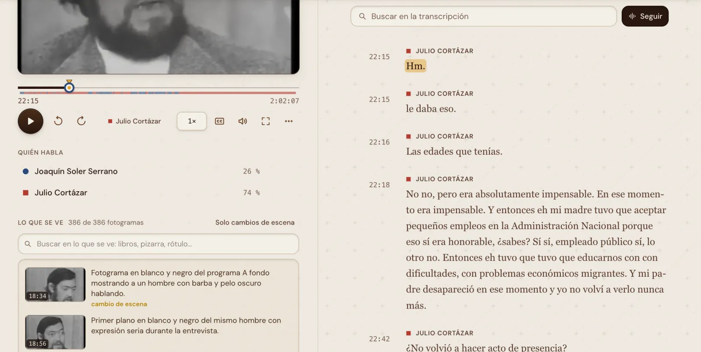
  <br><sub>La página impresa de verdad (p. 4, aunque sea la décima del escaneo) · en vídeo, quién habla, en qué minuto y lo que se ve.</sub>
</p>

<p align="center">
  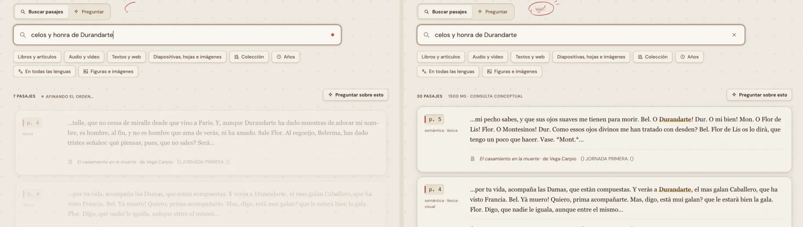
  <br><sub>Buscar: un primer resultado al instante y, un momento después, el orden definitivo.</sub>
</p>

<p align="center">
  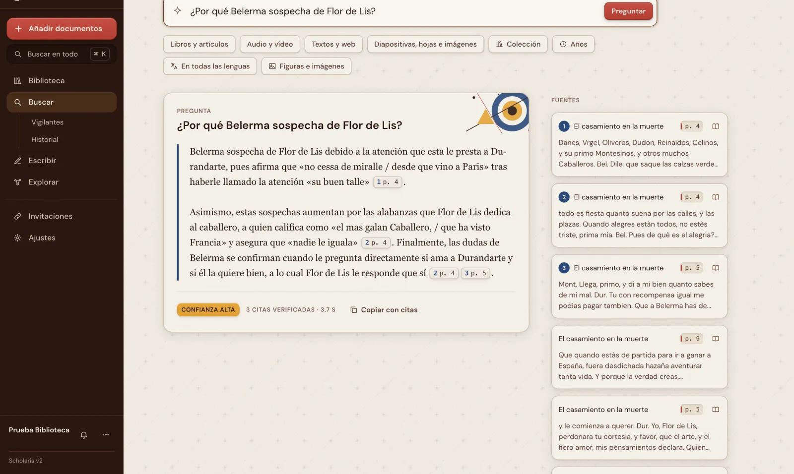
  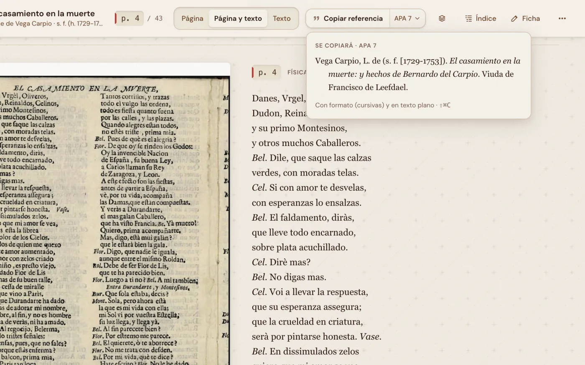
  <br><sub>Preguntar, con cada cita comprobada y su página · la referencia en tu estilo, a un clic.</sub>
</p>

<p align="center">
  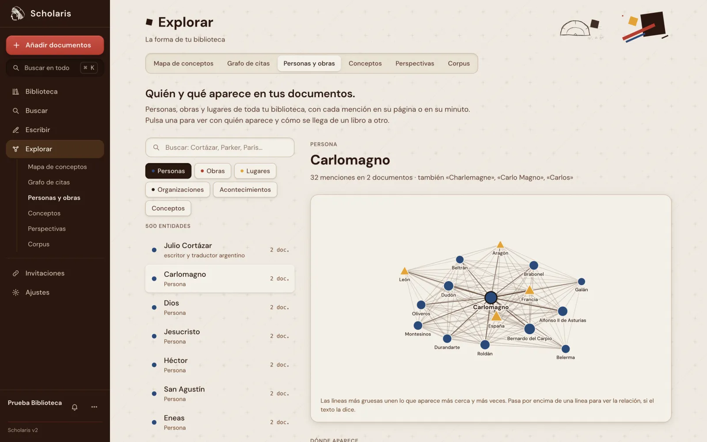
  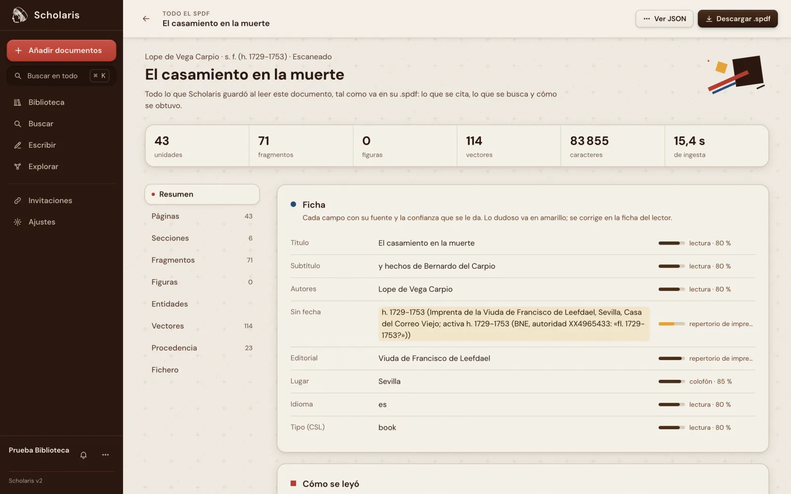
  <br><sub>Personas y obras de toda la biblioteca · «Todo el SPDF», lo que Scholaris guardó de cada documento y de dónde salió.</sub>
</p>

<p align="center">
  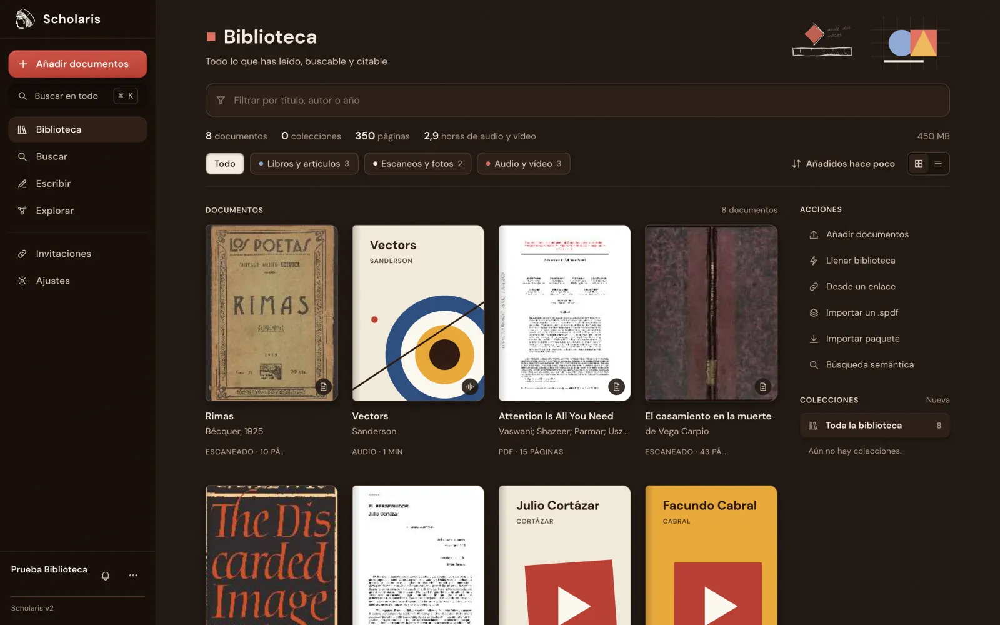
  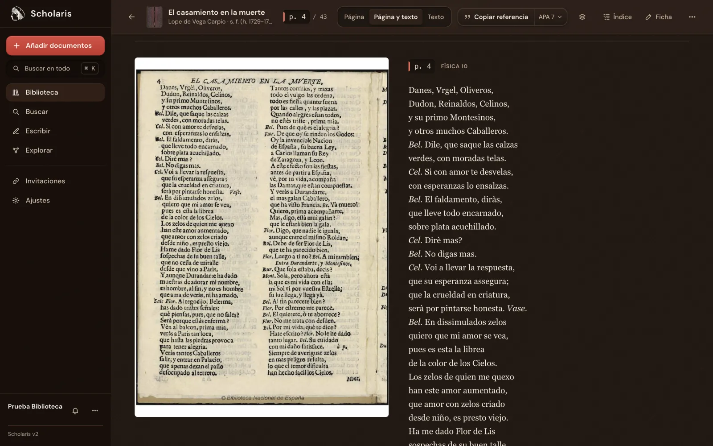
  <br><sub>También en modo oscuro.</sub>
</p>

<p align="center">
  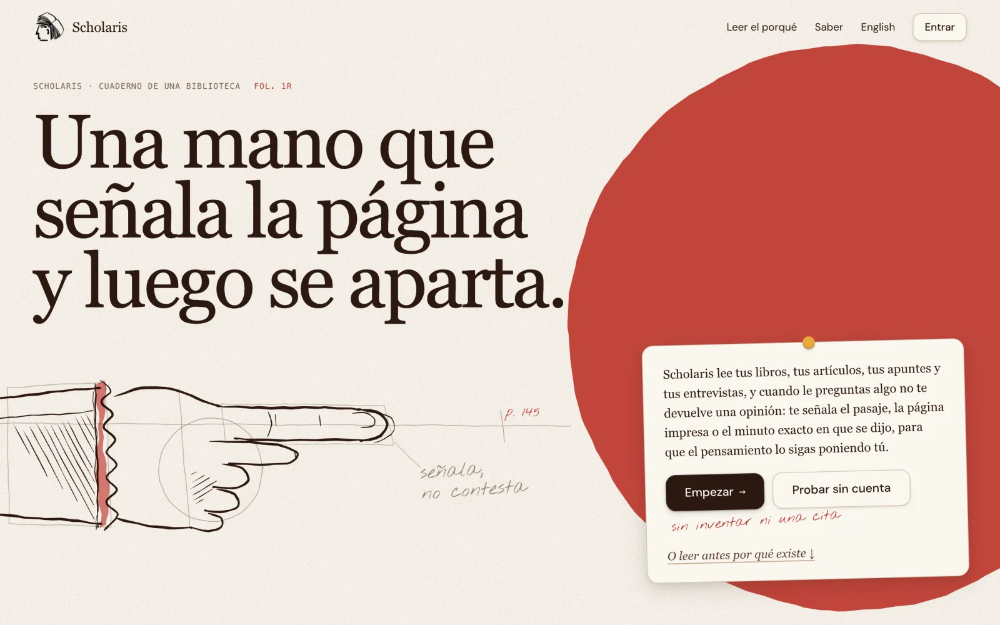
  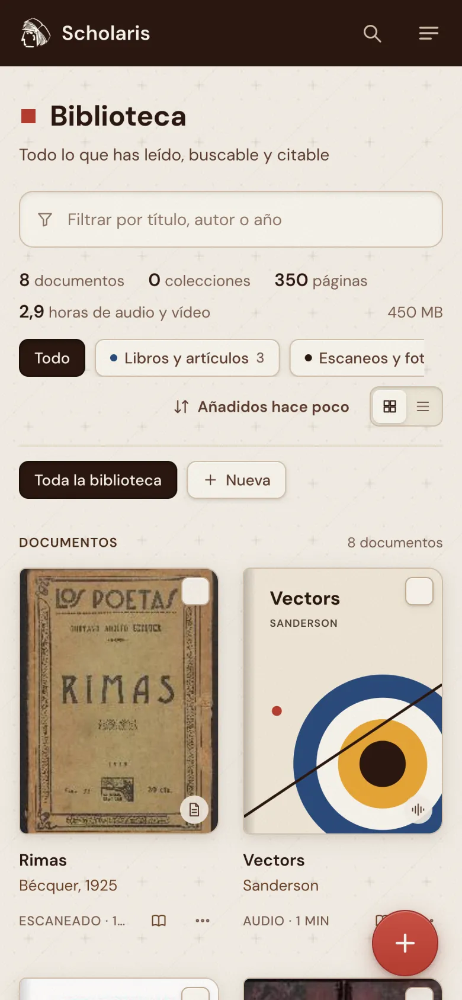
  <br><sub>La portada y la biblioteca en el móvil.</sub>
</p>

<p align="center">
  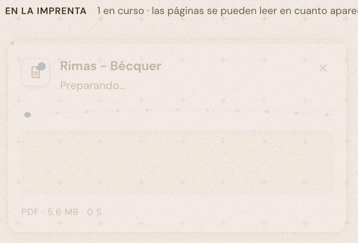
</p>

## Qué hace

- **Cualquier cosa entra.** PDF digitales o escaneados, fotos de páginas, EPUB, Word, presentaciones, hojas de cálculo, audio, vídeo y enlaces (webs, PDF, YouTube, pódcast). Todo se vuelve una biblioteca que se puede buscar y citar.
- **La página impresa.** El folio de verdad, aunque el libro empiece en romanos, la paginación salte o sea una comedia suelta del siglo XVII; y en audio y vídeo, el segundo exacto, con quién habla.
- **Preguntas a toda la biblioteca**, en cualquier lengua (también en castellano antiguo o en latín), con respuestas cuyas citas se comprueban una a una.
- **Tus citas, en tu estilo.** APA, MLA, Chicago, ISO 690 o cualquier estilo CSL; BibTeX y RIS; y una autocita que repasa tu borrador (texto o .docx) y propone cada referencia con su página.
- **Un formato abierto y tuyo.** Cada documento leído es un fichero **SPDF** (SQLite con el texto, las anclas, los vectores y la procedencia) que te llevas cuando quieras y que se abre sin Scholaris.
- **Para agentes y programas.** API REST, servidor MCP y un SDK de Python: `pip install scholaris-sdk`.

## Cuatro formas de tenerlo

| | Para quién | Lo que necesitas |
|---|---|---|
| [1. En tu ordenador, con Node](#1-en-tu-ordenador-con-node) | Quien programa o quiere tocar el código | Node 22+, pnpm y una clave de Gemini |
| [2. Docker, un fichero](#2-docker-un-fichero) | Un servidor de casa, de un grupo o de un departamento | Docker y una clave de Gemini |
| [3. Un solo ejecutable](#3-un-solo-ejecutable-de-escritorio) | Quien solo quiere usarlo en su portátil | Descargarlo y una clave de Gemini |
| [4. Cloudflare, una orden](#4-cloudflare-una-orden) | Una instancia en la nube con varias personas | Cuenta de Cloudflare (Workers de pago) |
| [La instancia alojada](https://scholaris.joseluissaorin.com) | Quien no quiere instalar nada | Una cuenta; hay un plan gratuito y planes de pago |

Las cuatro primeras son la misma aplicación: el mismo código de dominio con distintos puertos (SQLite y disco en local; D1, R2, Durable Objects y Vectorize en Cloudflare). Lo que guardas en una se exporta como `.spdf` y se abre en cualquiera de las otras.

### Las claves

Scholaris no trae inteligencia propia: la pone quien lo instala, con sus claves, y nada pasa por servidores del proyecto.

| Clave | ¿Hace falta? | Para qué |
|---|---|---|
| `GEMINI_API_KEY` ([Google AI Studio](https://aistudio.google.com/apikey)) | **Sí** | Leer páginas y escaneados, vectores de búsqueda (Gemini Embedding), transcribir audio y vídeo, metadatos, respuestas |
| `OPENROUTER_API_KEY` | No | Lector y redactor de reserva cuando Gemini falla o está saturado |
| `TYPESAFE_API_KEY` (Jev) | No, pero mejora mucho la búsqueda | Reordenador y juez de citas (en el banco, +0,07 de nDCG@10) |
| `CLOUDFLARE_ACCOUNT_ID` + `CLOUDFLARE_API_TOKEN` (Workers AI) | No | Whisper para transcribir barato, lector y reordenador de reserva |
| `OPENALEX_API_KEY` | No | Completar y comprobar fichas bibliográficas (Crossref y Wikidata no piden clave) |
| `INFERBOX_URL` + `INFERBOX_API_KEY` | No | Un servidor de inferencia propio con GPU: vectores, transcripción, reordenador y redacción en casa |

Basta con una de estas combinaciones: **Gemini sola**; **OpenRouter con un InferBox**; o **Workers AI** (`CLOUDFLARE_ACCOUNT_ID` y `CLOUDFLARE_API_TOKEN`). TypeSafe solo añade el reordenador y el juez.

**Sin conexión, hoy no.** Tus datos viven en tu disco, pero el servidor necesita al menos un lector en la nube (Gemini, OpenRouter o Workers AI) para arrancar la inteligencia: sin ninguno, ni la ingesta ni la búsqueda funcionan. Un InferBox se encarga en casa de los vectores, la transcripción, el reordenador y la redacción, pero no lee páginas. Lo que sí es tuyo sin red es el formato: cada `.spdf` es un SQLite que se abre, se lee y se busca sin Scholaris (con `sqlite3` o con `scholaris.v2.spdf4` del SDK de Python).

### 1. En tu ordenador, con Node

Requisitos: Node.js 22 o superior y pnpm 10 (`corepack enable`).

```bash
git clone https://github.com/joseluissaorin/scholaris-v2 scholaris && cd scholaris
pnpm install
pnpm --filter @scholaris/web build
GEMINI_API_KEY=tu-clave pnpm --filter @scholaris/local start
```

Abre <http://localhost:8790>. Sin la web compilada, el servidor solo da la API. Los datos van a `apps/local/datos`; mejor una ruta absoluta con `DATA_DIR=/ruta/a/mis-datos`. Si vas a entrar desde otro dispositivo de la red (o detrás de un dominio), pon también `PUBLIC_URL=http://tu-maquina:8790`: las subidas firman URL absolutas. Sin más variables es una instancia de una sola persona sin contraseña, pensada para tu propio ordenador; para dejarla en una red, ponle `SCHOLARIS_TOKEN=un-token-largo` o, para varias personas, `SCHOLARIS_USUARIOS="token:id:correo:Nombre;…"`. El resto de variables (puerto, URL pública, claves) está en la cabecera de [`apps/local/src/principal.ts`](apps/local/src/principal.ts).

### 2. Docker, un fichero

```bash
git clone https://github.com/joseluissaorin/scholaris-v2 scholaris && cd scholaris
echo "GEMINI_API_KEY=tu-clave" > deploy/docker/.env
docker compose -f deploy/docker/compose.yml up -d
```

La primera vez construye la imagen (unos 2 minutos; 1,3 GB). Abre <http://localhost:8790>. Los datos quedan en el volumen `scholaris-datos` y sobreviven a `down` y `up`. En `deploy/docker/.env` van también las claves opcionales, `SCHOLARIS_TOKEN` o `SCHOLARIS_USUARIOS` y `PUBLIC_URL`. La imagen también se publica ya construida en cada versión:

```bash
docker run -d --name scholaris -p 8790:8790 -v scholaris-datos:/data \
  -e GEMINI_API_KEY=tu-clave ghcr.io/joseluissaorin/scholaris:latest
```

Con una GPU NVIDIA, [InferBox](https://github.com/joseluissaorin/InferBox) se construye desde su repositorio y pone en casa vectores, transcripción, reordenador y redacción (pon `INFERBOX_API_KEY` en el `.env`):

```bash
docker compose -f deploy/docker/compose.yml -f deploy/docker/compose.gpu.yml up -d --build
```

### 3. Un solo ejecutable de escritorio

Descarga el de tu sistema en [Versiones](https://github.com/joseluissaorin/scholaris-v2/releases) (macOS Apple Silicon e Intel, Windows, Linux x64 y ARM; entre 90 y 120 MB), descomprímelo y ábrelo. Arranca el servidor en <http://localhost:8791> (solo para tu máquina), abre el navegador y guarda los datos en `~/Scholaris`. Las claves van en `~/Scholaris/claves.env`:

```bash
mkdir -p ~/Scholaris && echo "GEMINI_API_KEY=tu-clave" >> ~/Scholaris/claves.env
```

Los ejecutables no están firmados: en macOS ábrelo la primera vez con clic derecho → Abrir (o `xattr -d com.apple.quarantine scholaris-macos-arm64`), y en Windows, «Más información» → «Ejecutar de todas formas». Otras variables: `SCHOLARIS_DATOS` (otra carpeta) y `SCHOLARIS_NO_NAVEGADOR=1`.

El ejecutable no lleva los módulos nativos de Node: lo que subes desde la web se convierte en el navegador y queda igual que en las otras versiones, pero los PDF que llegan por la API se leen sin imágenes de página, y la búsqueda vectorial va sin `sqlite-vec` (más lenta con bibliotecas grandes). Para un servidor con muchos documentos, mejor Docker.

Para compilarlo tú (hace falta [Bun](https://bun.sh)):

```bash
pnpm install && pnpm --filter @scholaris/web build
bun run apps/escritorio/build.ts          # el de tu sistema, en apps/escritorio/dist
```

### 4. Cloudflare, una orden

Para una instancia en la nube como la alojada: un Worker con la API y la web, un Durable Object por persona, un Workflow por documento, D1, R2, Vectorize, Workers AI y una cola.

Necesitas una cuenta de Cloudflare con el plan **Workers de pago** (por los 5 minutos de CPU de los pasos de ingesta; Workflows, Vectorize y Queues a volumen real también lo piden), `npx wrangler login` hecho y una aplicación de [Clerk](https://clerk.com) para las cuentas de usuario (en la nube no hay usuario local).

```bash
pnpm install
export CLOUDFLARE_ACCOUNT_ID=tu-cuenta
node deploy/cloudflare/bootstrap.mjs --secretos-de mis-claves.env
```

`mis-claves.env` lleva `GEMINI_API_KEY`, `CLERK_PUBLISHABLE_KEY` y las opcionales de la tabla de arriba. El bootstrap es idempotente: copia [`wrangler.plantilla.jsonc`](deploy/cloudflare/wrangler.plantilla.jsonc) a `wrangler.propio.jsonc` (fuera de git), crea lo que falte (D1, KV, R2 con CORS, el índice de Vectorize con sus metadatos, la cola), rellena los ids, sube los secretos sin imprimirlos, genera los suyos propios (`SECRETO`, `CLAVE_MAESTRA`), compila la web y despliega en `workers.dev`. Volver a ejecutarlo es actualizar. La plantilla deja fuera dos piezas de la instancia alojada: el contenedor de conversión de Office y vídeo en el servidor ([`deploy/contenedor`](deploy/contenedor/LEEME.md); sin él, la web convierte en el navegador) y el correo de las invitaciones (necesita Email Routing en un dominio). `wrangler.jsonc` es la configuración de la instancia alojada y no te sirve tal cual.

### La instancia alojada

<https://scholaris.joseluissaorin.com> es Scholaris ya montado, sin claves que poner y con un plan gratuito. Pagar por ella es también la mejor forma de sostener el desarrollo de la versión abierta.

## Programar contra Scholaris

```bash
pip install scholaris-sdk
```

```python
from scholaris.api import Scholaris

s = Scholaris(base="http://localhost:8790")       # o Scholaris("sch_…") contra la instancia alojada
doc = s.subir("capitulo-3.pdf")                   # también una URL: web, PDF, YouTube, pódcast
for p in s.buscar("el panóptico y la mirada", k=3):
    print(p["cita"], p["texto"][:80])
print(s.citar("La vigilancia se interioriza.")["texto"])
```

La guía completa de la API (REST, MCP y `llms.txt` para agentes) está en `/api` de cualquier instancia; en la alojada, <https://scholaris.joseluissaorin.com/api>.

## El banco de pruebas

La búsqueda, las citas y los folios se miden contra un banco público y reproducible: un artículo con licencia CC BY, una comedia de Lope escaneada y una lectura de Bécquer en LibriVox, con 66 consultas, 2 387 juicios de relevancia, 19 afirmaciones para la autocita y 21 folios comprobados a ojo. Hoy: nDCG@10 0,90, Recall@20 0,95 y **ninguna cita inventada**. Véase [`bench/calidad/RESULTADOS.md`](bench/calidad/RESULTADOS.md); se ejecuta con `GEMINI_API_KEY=… pnpm bench calidad`.

## Contribuir

Lee [CONTRIBUTING.md](CONTRIBUTING.md). Para dudas, [SUPPORT.md](SUPPORT.md); para vulnerabilidades, [SECURITY.md](SECURITY.md).

## Licencia

Scholaris es software libre bajo la [Licencia Pública de la Unión Europea 1.2](LICENSE) (EUPL-1.2), compatible con GPL, AGPL, MPL y otras. Los estilos CSL, las tipografías y el resto de materiales de terceros tienen sus propias licencias, recogidas en [NOTICE.md](NOTICE.md).

Lo hace José Luis Saorín Ferrer, filólogo, programador y artista, en Santa Cruz de Tenerife.
